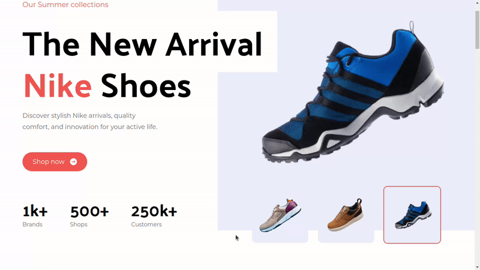

# Nike Landing Page Clone

This project is a clone of the Nike landing page, created for the purpose of practicing and showcasing my Tailwind CSS skills. It is developed using Next.js and styled with Tailwind CSS.

You can check out the live demo

## Technologies Used

- Next.js: Used as the React framework for building the website.
- Tailwind CSS: Utilized for rapid and responsive styling.

## Features

- Landing Page: A faithful recreation of the Nike landing page, including design elements and layout.
- Responsive Design: Ensures the website looks great on various screen sizes.
- Interactive Elements: Display of products can be changes by clicking on small thumbnails

